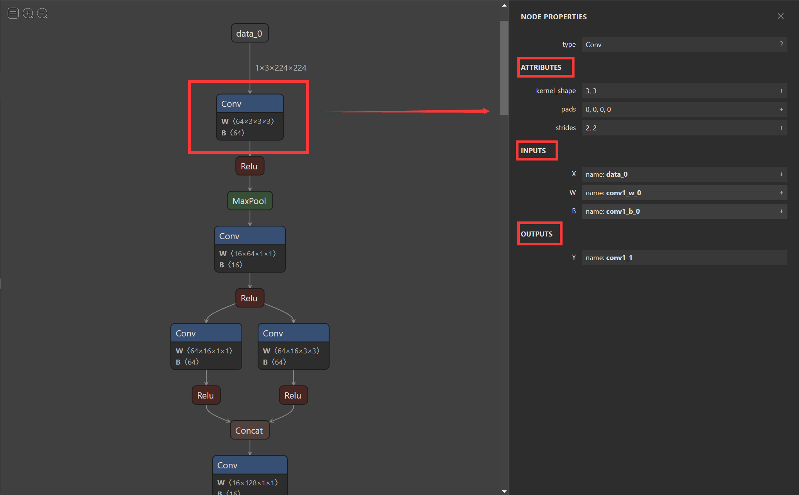

# 9.1 使用ONNX进行部署并推理

深度学习的最终目的是要实现模型的部署以方便我们的生活和解决传统方法不能解决的问题。通常人们会将模型部署在手机端、开发板，嵌入式设备上，但是这些设备上由于框架的规模，环境依赖，算力的限制，我们无法直接使用训练好的权重进行推理，因此我们需要将得到的权重进行变换才能使我们的模型可以成功部署在上述设备上。而经过工业界和学术界多年的探索，出现了以下的模型部署pipeline：


而在本节中我们会将PyTorch训练好的模型转换为ONNX 格式，然后使用ONNX Runtime运行它进行推理。通过本节课的学习，你将收获：

1. 模型部署的整体流程
2. 使用torch.onnx进行模型格式的转化
3. 使用ONNX Runtime进行模型推理
4. 完整的官方代码解释

## 9.1.1 ONNX和ONNX Runtime简介

### 9.1.1.1 ONNX简介

- ONNX官网：https://onnx.ai/
- ONNX GitHub：https://github.com/onnx/onnx

**ONNX( Open Neural Network Exchange)** 是 Facebook (现Meta) 和微软在2017年共同发布的，用于标准描述计算图的一种格式。ONNX通过定义一组与环境和平台无关的标准格式，使AI模型可以在不同框架和环境下交互使用，ONNX可以看作深度学习框架和部署端的桥梁，就像编译器的中间语言一样。由于各框架兼容性不一，我们通常只用 ONNX 表示更容易部署的静态图。硬件和软件厂商只需要基于ONNX标准优化模型性能，让所有兼容ONNX标准的框架受益。目前，ONNX主要关注在模型预测方面，使用不同框架训练的模型，转化为ONNX格式后，可以很容易的部署在兼容ONNX的运行环境中。目前，在微软，亚马逊 ，Facebook(现Meta) 和 IBM 等公司和众多开源贡献的共同维护下，ONNX 已经对接了下图的多种深度学习框架和多种推理引擎。


### 9.1.1.2 ONNX Runtime简介

- ONNX Runtime官网：https://www.onnxruntime.ai/
- ONNX Runtime GitHub：https://github.com/microsoft/onnxruntime

**ONNX Runtime** 是由微软维护的一个跨平台机器学习推理加速器，它直接对接ONNX，可以直接读取.onnx文件并实现推理，不需要再把 .onnx 格式的文件转换成其他格式的文件。PyTorch借助ONNX Runtime也完成了部署的最后一公里，构建了 PyTorch --> ONNX --> ONNX Runtime 部署流水线，我们只需要将模型转换为 .onnx 文件，并在 ONNX Runtime 上运行模型即可。

### 9.1.1.3 ONNX和ONNX Runtime的安装

ONNX和ONNX Runtime作为python的一个包与其他包的安装方法相同，我们可以选择使用conda或者pip进行安装，只需要输入以下命令即可：

```shell
# 激活虚拟环境
conda activate env_name # env_name换成环境名称
# 安装onnx
pip install onnx 
# 安装onnx runtime
pip install onnxruntime # 使用CPU进行推理
# pip install onnxruntime-gpu # 使用GPU进行推理
```

除此之外，我们还需要注意ONNX和ONNX Runtime之间的适配关系。我们可以访问ONNX Runtime的Github进行查看，链接地址如下：

ONNX和ONNX Runtime的适配关系：https://github.com/microsoft/onnxruntime/blob/master/docs/Versioning.md

当我们想使用GPU进行推理时，我们需要先将安装的onnxruntime卸载，再安装onnxruntime-gpu，同时我们还需要考虑ONNX Runtime与CUDA之间的适配关系，我们可以参考以下链接进行查看：

ONNX Runtime和CUDA之间的适配关系：https://onnxruntime.ai/docs/execution-providers/CUDA-ExecutionProvider.html

## 9.1.2 模型导出为ONNX

### 9.1.2.1 模型转换为ONNX格式

在接下来的部分，我们将使用`torch.onnx.export()`把模型转换成 ONNX 格式的函数。模型导成onnx格式前，我们必须调用`model.eval()`或者`model.train(False)`以确保我们的模型处在推理模式下，避免因为`dropout`或`batchnorm`等运算符在推理和训练模式下的不同产生错误。（因为本课程偏向实战，对于ONNX的内部流程不做过多赘述，有兴趣的同学可以进行更深一步了解）

```python
import torch.onnx 
# 转换的onnx格式的名称，文件后缀需为.onnx
onnx_file_name = "xxxxxx.onnx"
# 我们需要转换的模型，将torch_model设置为自己的模型
model = torch_model
# 加载权重，将model.pth转换为自己的模型权重
# 如果模型的权重是使用多卡训练出来，我们需要去除权重中多的module. 具体操作可以见5.4节
model = model.load_state_dict(torch.load("model.pth"))
# 导出模型前，必须调用model.eval()或者model.train(False)
model.eval()
# dummy_input就是一个输入的实例，仅提供输入shape、type等信息 
batch_size = 1 # 随机的取值，当设置dynamic_axes后影响不大
dummy_input = torch.randn(batch_size, 1, 224, 224, requires_grad=True) 
# 这组输入对应的模型输出
output = model(dummy_input)
# 导出模型
torch.onnx.export(model,        # 模型的名称
                  dummy_input,   # 一组实例化输入
                  onnx_file_name,   # 文件保存路径/名称
                  export_params=True,        #  如果指定为True或默认, 参数也会被导出. 如果你要导出一个没训练过的就设为 False.
                  opset_version=10,          # ONNX 算子集的版本，当前已更新到15
                  do_constant_folding=True,  # 是否执行常量折叠优化
                  input_names = ['input'],   # 输入模型的张量的名称
                  output_names = ['output'], # 输出模型的张量的名称
                  # dynamic_axes将batch_size的维度指定为动态，
                  # 后续进行推理的数据可以与导出的dummy_input的batch_size不同
                  dynamic_axes={'input' : {0 : 'batch_size'},    
                                'output' : {0 : 'batch_size'}})

```

### 9.1.2.2 ONNX模型的检验

当上述代码运行成功后，我们会得到一个ONNX 模型文件。我们需要检测下我们的模型文件是否可用，我们将通过`onnx.checker.check_model()`进行检验，具体方法如下：

```python
import onnx
# 我们可以使用异常处理的方法进行检验
try:
    # 当我们的模型不可用时，将会报出异常
    onnx.checker.check_model(self.onnx_model)
except onnx.checker.ValidationError as e:
    print("The model is invalid: %s"%e)
else:
    # 模型可用时，将不会报出异常，并会输出“The model is valid!”
    print("The model is valid!")
```

### 9.1.2.3 ONNX可视化

在将模型导出为onnx格式后，我们希望有个工具可以像Tensorboard一样可视化模型来观察每个节点的属性特征。随着`Netron`的出现，我们也可以实现onnx的可视化。
- Netron下载网址：https://github.com/lutzroeder/netron


使用Netron进行可视化后，我们不仅能看到整体模型的架构，还能看到每一个节点的信息。在接下来的内容中我们将以Netron官方提供的[squeezenet](https://netron.app/?url=https://media.githubusercontent.com/media/onnx/models/main/vision/classification/squeezenet/model/squeezenet1.0-3.onnx)为例进行介绍。下面第一幅图截取自squeezenet网络，我们可以看到网络的整体流程和输入。


第二幅图显示了第一个Conv的信息包括kernel_size，strides，input，output等信息，同理当我们点击其他节点时也可以显示该节点的信息。



## 9.1.3 使用ONNX Runtime进行推理

通过以上的操作，我们已经完成了PyTorch的模型到ONNX模型的转换，并通过Netron可视化和`onnx.checker.check_model()`检查了模型的正确性。在这一步，我们将使用ONNX Runtime运行一下转化后的模型，看一下推理后的结果。

```python
# 导入onnxruntime
import onnxruntime
# 需要进行推理的onnx模型文件名称
onnx_file_name = "xxxxxx.onnx"

# onnxruntime.InferenceSession用于获取一个 ONNX Runtime 推理器
ort_session = onnxruntime.InferenceSession(onnx_file_name)  

# 构建字典的输入数据，字典的key需要与我们构建onnx模型时的input_names相同
# 输入的input_img 也需要改变为ndarray格式
ort_inputs = {'input': input_img} 
# 我们更建议使用下面这种方法,因为避免了手动输入key
# ort_inputs = {ort_session.get_inputs()[0].name:input_img}

# run是进行模型的推理，第一个参数为输出张量名的列表，一般情况可以设置为None
# 第二个参数为构建的输入值的字典
# 由于返回的结果被列表嵌套，因此我们需要进行[0]的索引
ort_output = ort_session.run(None,ort_inputs)[0]
# output = {ort_session.get_outputs()[0].name}
# ort_output = ort_session.run([output], ort_inputs)[0]

```

在上述的步骤中，我们有几个需要注意的点：

1. PyTorch模型的输入为tensor，而ONNX的输入为array，因此我们需要对张量进行变换或者直接将数据读取为array格式，我们可以实现下面的方式进行张量到array的转化。

```python
def to_numpy(tensor):
    return tensor.detach().cpu().numpy() if tensor.requires_grad else tensor.cpu().numpy()
```

2. 输入的array的shape应该和我们导出模型的`dummy_input`的shape相同，如果图片大小不一样，我们应该先进行resize操作。
3. run的结果是一个列表，我们需要进行索引操作才能获得array格式的结果。
4. 在构建输入的字典时，我们需要注意字典的key应与导出ONNX格式设置的input_name相同，因此我们更建议使用上述的第二种方法构建输入的字典。

## 9.1.4 代码实战

本部分代码选自PyTorch官网示例代码，访问链接可点击下方推荐阅读2进行查看和使用官网提供的Colab对onnx导出进行进一步理解。*如有侵权，可立即删除*

### 1. 定义超分辨模型

```python
# 导入相关包
import io
import numpy as np
from torch import nn
import torch.utils.model_zoo as model_zoo
import torch.onnx
import torch.nn as nn
import torch.nn.init as init

# 定义超分辨网络
class SuperResolutionNet(nn.Module):
    def __init__(self, upscale_factor, inplace=False):
        super(SuperResolutionNet, self).__init__()

        self.relu = nn.ReLU(inplace=inplace)
        self.conv1 = nn.Conv2d(1, 64, (5, 5), (1, 1), (2, 2))
        self.conv2 = nn.Conv2d(64, 64, (3, 3), (1, 1), (1, 1))
        self.conv3 = nn.Conv2d(64, 32, (3, 3), (1, 1), (1, 1))
        self.conv4 = nn.Conv2d(32, upscale_factor ** 2, (3, 3), (1, 1), (1, 1))
        self.pixel_shuffle = nn.PixelShuffle(upscale_factor)

        self._initialize_weights()

    def forward(self, x):
        x = self.relu(self.conv1(x))
        x = self.relu(self.conv2(x))
        x = self.relu(self.conv3(x))
        x = self.pixel_shuffle(self.conv4(x))
        return x
    
	# 模型初始化
    def _initialize_weights(self):
        init.orthogonal_(self.conv1.weight, init.calculate_gain('relu'))
        init.orthogonal_(self.conv2.weight, init.calculate_gain('relu'))
        init.orthogonal_(self.conv3.weight, init.calculate_gain('relu'))
        init.orthogonal_(self.conv4.weight)

# 实例化模型
torch_model = SuperResolutionNet(upscale_factor=3)
```

### 2. 模型导出为ONNX格式

```python
model_url = 'https://s3.amazonaws.com/pytorch/test_data/export/superres_epoch100-44c6958e.pth'
batch_size = 1    # just a random number
# 加载预训练得到权重
map_location = lambda storage, loc: storage
if torch.cuda.is_available():
    map_location = None
torch_model.load_state_dict(model_zoo.load_url(model_url, map_location=map_location))

# 将模型设置为推理模式
torch_model.eval()
# Input to the model
x = torch.randn(batch_size, 1, 224, 224, requires_grad=True)
torch_out = torch_model(x)

# 导出模型
torch.onnx.export(torch_model,               # model being run
                  x,             # model input (or a tuple for multiple inputs)
                  "super_resolution.onnx",   # where to save the model (can be a file or file-like object)
                  export_params=True,        # store the trained parameter weights inside the model file
                  opset_version=10,   # the ONNX version to export the model to
                  do_constant_folding=True,  # whether to execute constant folding for optimization
                  input_names = ['input'],   # the model's input names
                  output_names = ['output'], # the model's output names
                  # variable length axes
                  dynamic_axes={'input' : {0 : 'batch_size'},    
                                'output' : {0 : 'batch_size'}})
```

### 3. 检验ONNX模型

```python
import onnx
# 我们可以使用异常处理的方法进行检验
try:
    # 当我们的模型不可用时，将会报出异常
    onnx.checker.check_model("super_resolution.onnx")
except onnx.checker.ValidationError as e:
    print("The model is invalid: %s"%e)
else:
    # 模型可用时，将不会报出异常，并会输出“The model is valid!”
    print("The model is valid!")
```

### 4. 使用ONNX Runtime进行推理

```python
import onnxruntime

ort_session = onnxruntime.InferenceSession("super_resolution.onnx")

# 将张量转化为ndarray格式
def to_numpy(tensor):
    return tensor.detach().cpu().numpy() if tensor.requires_grad else tensor.cpu().numpy()

# 构建输入的字典和计算输出结果
ort_inputs = {ort_session.get_inputs()[0].name: to_numpy(x)}
ort_outs = ort_session.run(None, ort_inputs)

# 比较使用PyTorch和ONNX Runtime得出的精度
np.testing.assert_allclose(to_numpy(torch_out), ort_outs[0], rtol=1e-03, atol=1e-05)

print("Exported model has been tested with ONNXRuntime, and the result looks good!")
```

### 5. 进行实际预测并可视化

```python
from PIL import Image
import torchvision.transforms as transforms

# 读取图片
img = Image.open("/cat_224x224.jpg")
# 对图片进行resize操作
resize = transforms.Resize([224, 224])
img = resize(img)

img_ycbcr = img.convert('YCbCr')
img_y, img_cb, img_cr = img_ycbcr.split()

to_tensor = transforms.ToTensor()
img_y = to_tensor(img_y)
img_y.unsqueeze_(0)
# 构建输入的字典并将value转换位array格式
ort_inputs = {ort_session.get_inputs()[0].name: to_numpy(img_y)}
ort_outs = ort_session.run(None, ort_inputs)
img_out_y = ort_outs[0]
img_out_y = Image.fromarray(np.uint8((img_out_y[0] * 255.0).clip(0, 255)[0]), mode='L')

# 保存最后得到的图片
final_img = Image.merge(
    "YCbCr", [
        img_out_y,
        img_cb.resize(img_out_y.size, Image.BICUBIC),
        img_cr.resize(img_out_y.size, Image.BICUBIC),
    ]).convert("RGB")

final_img.save("/cat_superres_with_ort.jpg")
```

## 9.1.5 推荐阅读

1. [miscroft-将 PyTorch 训练模型转换为 ONNX](https://docs.microsoft.com/zh-cn/windows/ai/windows-ml/tutorials/pytorch-convert-model)
2. [pytorch- EXPORTING A MODEL FROM PYTORCH TO ONNX AND RUNNING IT USING ONNX RUNTIME](https://pytorch.org/tutorials/advanced/super_resolution_with_onnxruntime.html)
3. [ONNX tutorials](https://github.com/onnx/tutorials#converting-to-onnx-format)

