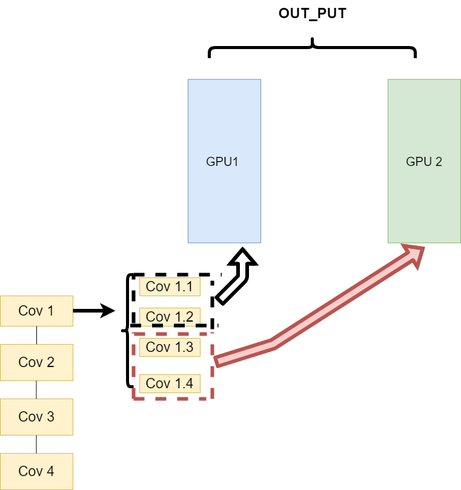

# 2.3 并行计算简介

在利用PyTorch做深度学习的过程中，可能会遇到数据量较大无法在单块GPU上完成，或者需要提升计算速度的场景，这时就需要用到并行计算。完成本节内容时，请你确保至少安装了一个NVIDIA GPU并安装了相关的驱动。

经过本节的学习，你将收获：

- 并行计算的简介
- CUDA简介
- 并行计算的三种实现方式
- 使用CUDA加速训练

## 2.3.1  为什么要做并行计算

深度学习的发展离不开算力的发展，GPU的出现让我们的模型可以训练的更快，更好。所以，如何充分利用GPU的性能来提高我们模型学习的效果，这一技能是我们必须要学习的。这一节，我们主要讲的就是PyTorch的并行计算。PyTorch可以在编写完模型之后，让多个GPU来参与训练，减少训练时间。你可以在命令行使用`nvidia-smi`命令来查看你的GPU信息和使用情况。

## 2.3.2  为什么需要CUDA

`CUDA`是NVIDIA提供的一种GPU并行计算框架。对于GPU本身的编程，使用的是`CUDA`语言来实现的。但是，在我们使用PyTorch编写深度学习代码时，使用的`CUDA`又是另一个意思。在PyTorch使用 `CUDA`表示要开始要求我们的模型或者数据开始使用GPU了。

在编写程序中，当我们使用了 `.cuda()` 时，其功能是让我们的模型或者数据从CPU迁移到GPU上（默认是0号GPU）当中，通过GPU开始计算。

注：
1. 我们使用GPU时使用的是`.cuda()`而不是使用`.gpu()`。这是因为当前GPU的编程接口采用CUDA，但是市面上的GPU并不是都支持CUDA，只有部分NVIDIA的GPU才支持，AMD的GPU编程接口采用的是OpenCL，在现阶段PyTorch并不支持。
2. 数据在GPU和CPU之间进行传递时会比较耗时，我们应当尽量避免数据的切换。
3. GPU运算很快，但是在使用简单的操作时，我们应该尽量使用CPU去完成。
4. 当我们的服务器上有多个GPU，我们应该指明我们使用的GPU是哪一块，如果我们不设置的话，tensor.cuda()方法会默认将tensor保存到第一块GPU上，等价于tensor.cuda(0)，这将有可能导致爆出`out of memory`的错误。我们可以通过以下两种方式继续设置。
   1.  ```python
        #设置在文件最开始部分
       import os
       os.environ["CUDA_VISIBLE_DEVICE"] = "2" # 设置默认的显卡
       ```
   2.  ```bash
        CUDA_VISBLE_DEVICE=0,1 python train.py # 使用0，1两块GPU
       ```


## 2.3.3  常见的并行的方法：

### 网络结构分布到不同的设备中(Network partitioning)

在刚开始做模型并行的时候，这个方案使用的比较多。其中主要的思路是，将一个模型的各个部分拆分，然后将不同的部分放入到GPU来做不同任务的计算。其架构如下：


这里遇到的问题就是，不同模型组件在不同的GPU上时，GPU之间的传输就很重要，对于GPU之间的通信是一个考验。但是GPU的通信在这种密集任务中很难办到，所以这个方式慢慢淡出了视野。

### 同一层的任务分布到不同数据中(Layer-wise partitioning)

第二种方式就是，同一层的模型做一个拆分，让不同的GPU去训练同一层模型的部分任务。其架构如下：



这样可以保证在不同组件之间传输的问题，但是在我们需要大量的训练，同步任务加重的情况下，会出现和第一种方式一样的问题。

### 不同的数据分布到不同的设备中，执行相同的任务(Data parallelism)

第三种方式有点不一样，它的逻辑是，我不再拆分模型，我训练的时候模型都是一整个模型。但是我将输入的数据拆分。所谓的拆分数据就是，同一个模型在不同GPU中训练一部分数据，然后再分别计算一部分数据之后，只需要将输出的数据做一个汇总，然后再反传。其架构如下：


这种方式可以解决之前模式遇到的通讯问题。现在的主流方式是**数据并行**的方式(Data parallelism)

## 2.3.4 使用CUDA加速训练

### 单卡训练
在PyTorch框架下，CUDA的使用变得非常简单，我们只需要显式的将数据和模型通过`.cuda()`方法转移到GPU上就可加速我们的训练。如下：

```python
model = Net()
model.cuda() # 模型显示转移到CUDA上

for image,label in dataloader:
    # 图像和标签显示转移到CUDA上
    image = image.cuda() 
    label = label.cuda()
```

### 多卡训练
PyTorch提供了两种多卡训练的方式，分别为`DataParallel`和`DistributedDataParallel`（以下我们分别简称为DP和DDP）。这两种方法中官方更推荐我们使用`DDP`，因为它的性能更好。但是`DDP`的使用比较复杂，而`DP`经需要改变几行代码既可以实现，所以我们这里先介绍`DP`，再介绍`DDP`。