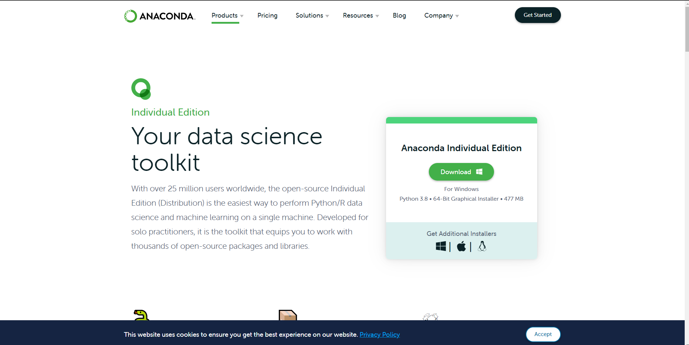
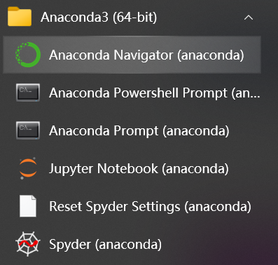
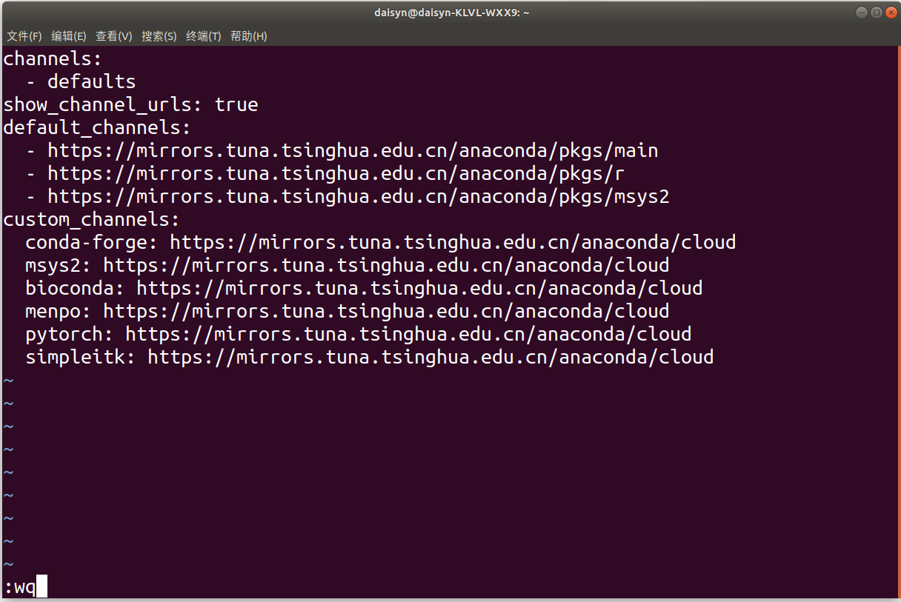
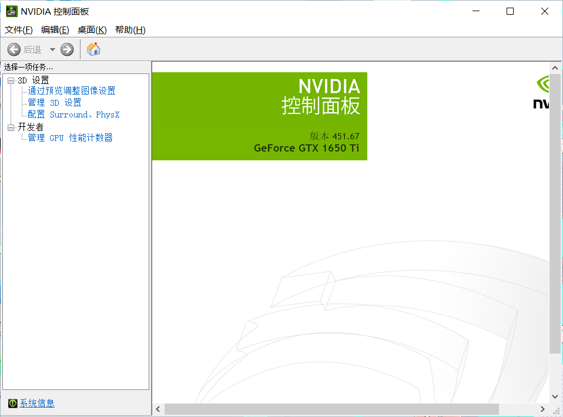
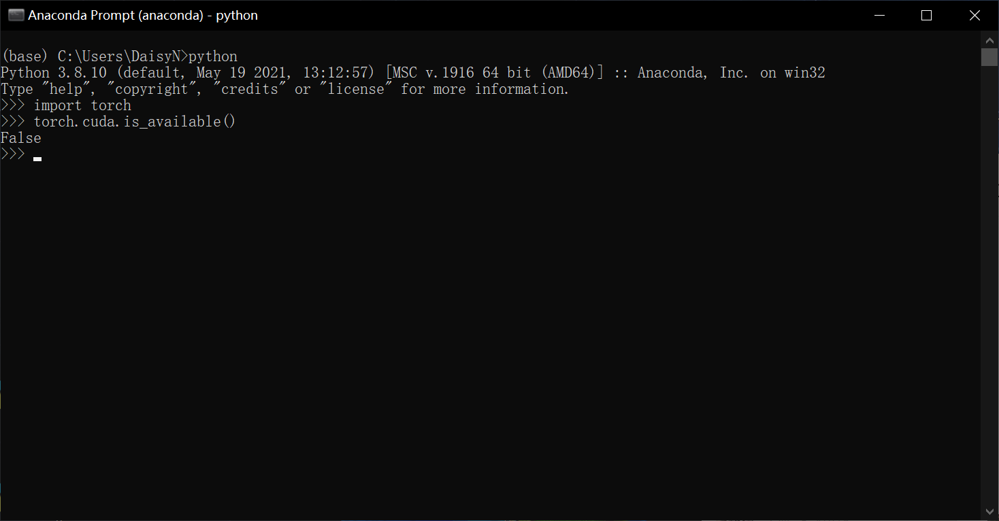
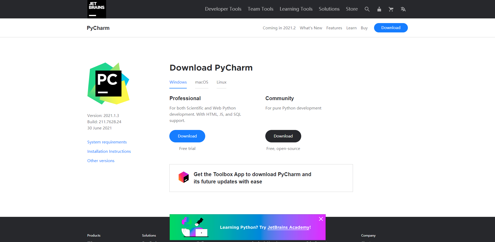

## PyTorch的安装

PyTorch的安装，一般常见的是**Anaconda/miniconda+Pytorch**+ (Pycharm) 的工具，我们的安装分为以下几步

1. Anaconda的安装
2. 检查有无NVIDIA GPU
3. PyTorch的安装
4. Pycharm的安装 ( Windows系统上更为常用）

#### 1.2.1 Anaconda的安装

在DL和ML中，要用到大量成熟的package。一个个安装 package 很麻烦，而且容易出现奇奇怪怪的问题。而 Anaconda很好的解决了我们的问题，它集成了常用于科学分析（机器学习， 深度学习）的大量package。省略了我们安装一些package的过程。

**Step 1**：登陆[Anaconda | Individual Edition](https://www.anaconda.com/products/individual)，选择相应系统DownLoad，此处以Windows为例：



**Step 2**：在开始页找到Anaconda Prompt，一般在Anaconda3的文件夹下,( Linux在终端下就行了）



**Step 3**：创建虚拟环境

Linux在终端(`Ctrl`+`Alt`+`T`)进行，Windows在`Anaconda Prompt`进行

+ **查看已经安装好的虚拟环境**，可以看到我们这里已经有两个环境存在了

```python
conda env list  
```


+ **创建虚拟环境test**，要记住我们创建环境的地址哦！

  ```
  conda create -n 虚拟环境名称 python==版本名称
  ```


##### 这里忽略我们的warning，因为我们测试的时候已经安了又卸载一遍了，正常时是不会有warning的。

**tips：在选择Python版本时，不要选择太高，建议选择3.6-3.8，版本过高会导致相关库不适配。**

+ **删除虚拟环境命令**

```pytho
conda remove -n 名称 -all
```

+ **激活环境命令**

```
conda activate 名称
```

**Step 4**：Anaconda换源

在安装package时，我们经常会使用pip install ...和conda install ... 的命令，但是一些package下载速度会很慢，因此我们需要进行换源，换成国内源，加快我们的下载速度。以下便是两种对应方式的换源

- **pip换源**

**Linux：**

在用户目录下新建文件夹**.pip**：`mkdir ~/.pip`

在文件夹内新建文件**pip.conf**, `vim ~/.pip/pip.conf`并添加下方的内容

**Windows：**

1、文件管理器文件路径地址栏敲：`%APPDATA%` 回车，快速进入 `C:\Users\电脑用户\AppData\Roaming` 文件夹中
2、新建 pip 文件夹并在文件夹中新建 `pip.ini` 配置文件
3、我们需要在pip.ini 配置文件内容，你可以选择使用记事本打开，输入以下内容，输入完后记得按下ctrl+s保存哦，在这里我们使用的是豆瓣源

```
[global]
index-url = http://pypi.douban.com/simple
[install]
use-mirrors =true
mirrors =http://pypi.douban.com/simple/
trusted-host =pypi.douban.com
```

- **conda换源**（换成清华源）[官方换源帮助](https://mirrors.tuna.tsinghua.edu.cn/help/anaconda/)

##### Windows系统：

TUNA 提供了 Anaconda 仓库与第三方源的镜像，各系统都可以通过修改用户目录下的 `.condarc` 文件。Windows 用户无法直接创建名为 `.condarc` 的文件，可先执行`conda config --set show_channel_urls yes`生成该文件之后再修改。

完成这一步后，我们需要在**C:\Users\电脑用户\找到 `.condarc`**这个文件,打开后将文件里原始内容删除，将下面的内容复制进去，并且保存

```
channels:
  - defaults
show_channel_urls: true
default_channels:
  - https://mirrors.tuna.tsinghua.edu.cn/anaconda/pkgs/main
  - https://mirrors.tuna.tsinghua.edu.cn/anaconda/pkgs/r
  - https://mirrors.tuna.tsinghua.edu.cn/anaconda/pkgs/msys2
custom_channels:
  conda-forge: https://mirrors.tuna.tsinghua.edu.cn/anaconda/cloud
  msys2: https://mirrors.tuna.tsinghua.edu.cn/anaconda/cloud
  bioconda: https://mirrors.tuna.tsinghua.edu.cn/anaconda/cloud
  menpo: https://mirrors.tuna.tsinghua.edu.cn/anaconda/cloud
  pytorch: https://mirrors.tuna.tsinghua.edu.cn/anaconda/cloud
  simpleitk: https://mirrors.tuna.tsinghua.edu.cn/anaconda/cloud
```

这一步完成后，我们需要打开`Anaconda Prompt` 运行 `conda clean -i` 清除索引缓存，保证用的是镜像站提供的索引。

##### Linux系统（操作均在终端就行）：

`Ctrl` +`Alt`+`t`打开终端 输入以下命令

`cd ~`  进入用户中心

`vim  .condarc` 修改`.condarc`文件


输入`i`进入编辑模式，将上方内容粘贴进去，按`ESC`退出编辑模式，输入`:wq`保存并退出



检查下是否换源成功，好嘞，这样就换源成功了


不要忘记`conda clean -i` 清除索引缓存，保证用的是镜像站提供的索引

#### 1.2.2 查看自己的显卡（CPU或者集显的小伙伴们可以跳过该部分）

- **对于windows系统：**

在`cmd/terminal中`输入`nvidia-smi`（Linux和Win命令一样）、使用NVIDIA控制面板或者使用任务管理器查看自己是否有NVIDIA的独立显卡及其型号





- **对于linux系统：**


看下版本号，看自己可以兼容的CUDA版本，等会安装Pytorch时是可以向下兼容的


#### 1.2.3 安装Pytorch

**Step 1**：登录官网[Pytorch官网](https://pytorch.org/)


**Step 2**：点击Install按钮，进入相关界面


这个界面我们可以选择本地开始（Start Locally），云开发（Cloud Partners)，以前的Pytorch版本（Previous Pytorch Versions），移动端开发（Mobile），在此处我们需要进行本地安装。

**Step 3**：结合自己情况选择命令并复制下来，然后使用conda下载或者pip下载（建议conda安装！）

打开`Pycharm`下方的`Terminal`，输入`conda activate test`，激活环境并切换到环境下面，我们就可以进行Pytorch的安装了。


##### 注意事项

1. **Stable**代表的是稳定版本，**Preview**代表的是先行版本
2. 可以结合电脑是否有显卡，选择CPU版本还是CUDA版本，建议还是需要NVIDIA GPU
3. 官方建议我们使用**Anaconda**来进行管理
4. 关于安装的系统要求

   1. **Windows**：
      1. Windows 7及更高版本；建议使用Windows 10或者更高的版本
      2. Windows Server 2008 r2 及更高版本
   2. **Linux：以常见的CentOS和Ubuntu为例**
      1. CentOS, 最低版本7.3-1611
      2. Ubuntu, 最低版本 13.04，这里会导致cuda安装的最大版本不同
   3. **macOS**：
      1. macOS 10.10及其以上

5. 有些电脑所支持的cuda版本<10.2，此时我们需要进行手动降级，即就是cudatoolkit = 你所适合的版本，但是这里需要注意下一定要保持Pytorch和cudatoolkit的版本适配。查看[Previous PyTorch Versions | PyTorch](https://pytorch.org/get-started/previous-versions/)

**Step 4**：在线下载

如果你是在`Anaconda Prompt`进行下载的话，先输入`conda activate test`，激活到我们的虚拟环境中去，再输入命令

如果是在`Pycharm`的`Terminal`中下载的话，我们还是要先切换到我们的虚拟环境中去，再输入下载命令

Tips:要把下载指令后面的 -c pytorch 去掉不然还是默认下载源头（去掉后使用的是清华源）不删除会报HTTP error错误

**Step 5**：离线下载

##### Windows：

在安装的过程中，我们可能会出现一些奇奇怪怪的问题，导致在线下载不成功，我们也可以使用**离线下载**的方法进行。

**下载地址**：https://mirrors.tuna.tsinghua.edu.cn/anaconda/cloud/pytorch/

通过上面下载地址，下载好对应版本的pytorch和 torchvision 包，然后打开`Anaconda Prompt`/`Terminal`中，输入

> cd 压缩包的位置

##### 激活环境

> conda activate 环境名称

接下来输入以下命令安装两个包

```
conda install --offline pytorch压缩包的全称（后缀都不能忘记）
conda install --offline torchvision压缩包的全称（后缀都不能忘记）
```

**Step 6**：检验是否安装成功

进入所在的**虚拟环境**，输入

```python
import torch

torch.cuda.is_available()
```

这条命令意思是检验是否可以调用cuda，如果**安装的是CPU的小伙伴们会返回False，GPU的小伙伴会返回true**。一般这个命令不报错的话就证明安装成功。

- Windows系统



- Linux系统


Pytorch的安装绝对是一个容易上火的过程，而且网络上的教程很可能对应早期的版本，或是会出现一些奇奇怪怪的问题，但是别担心，多装几次多遇到点奇奇怪怪的问题就好了，加油！


####  1.2.4 PyCharm安装（可选操作）

VSCode这些也是ok的，安装PyCharm非必须操作

Linux，Windows此处操作相同，我们建议Windows的同学安装Pycharm即可，因为在Linux上pycharm并不是主流的IDE。

**Step 1**：进入[官网](https://www.jetbrains.com/pycharm/)下载，如果是学生的话可以使用学生邮箱白嫖下载Professional，Community也是ok的



**Step 2：**配置环境，打开PyCharm，点击File -->Settings -->Project:你的项目名称-->Python Interpreter

进去后，我们可以看见他使用的是默认的base环境，现在我们需要将这个环境设置成我们的`test`环境,点击`齿轮`，选择`Add`


点击`Conda Environment` ，选择`Existing environment`，将`Interpreter`设置为test环境下的`python.exe`


注：如果在pycharm的环境时，想进入我们的虚拟环境，要使用`conda activate 名称`

